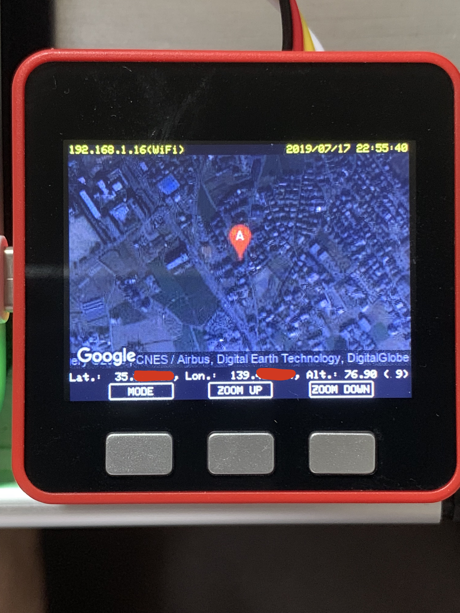

# GPSViewer

M5Stack を使った GPS 取得と地図表示

## 外観



## 必要なもの

- ハードウェア
  - M5Stack FIRE
    - FIRE を使ったのは、Grove コネクタで繋いだため。
    - Basic や Gray なら MBUS コネクタなどで接続すれば OK。
  - GPS ユニット
    - ＧＰＳ／ＧＬＯＮＡＳＳ受信機（Ｇａｌｉｌｅｏ／ＢｅｉＤｏｕ可）ｕ‐ｂｌｏｘ　Ｍ８搭載　みちびき３機受信対応( http://akizukidenshi.com/catalog/g/gM-12905/ )
    - 出力データ形式が TinyGPSPlus に合っていればいいので、他のものでも問題ないと思います。
- ソフトウェア
  - Visual Studio Code
  - PlatformIO

## 使用ライブラリ

- M5Stack ( https://github.com/m5stack/m5stack?utm_source=platformio&utm_medium=piohome )
- TinyGPSPlus ( https://github.com/mikalhart/TinyGPSPlus )
  - GPS パーサ・ライブラリ
- Google StaticMaps API ( https://developers.google.com/maps/documentation/maps-static/intro )
  - インターネット接続必須の REST API
  - 有償（ただし、月あたり 200 ドルの無料クレジットがあるので、大抵は無料で済むらしい。）

## コンフィギュレーション

1. config.h
   - define
     - WIFI_SSID : WiFi SSID
     - WIFI_PASS : WiFi Password
     - NTP_SERVER : NTP サーバ・アドレス
     - API_KEY : Google から取得した API キー文字列
1. platformio.ini

   - M5Stack Basic or Gray 使用時
     ```
     board = m5stack-core-esp32
     ```
   - M5Stack FIRE 使用時
     ```
     board = m5stack-fire
     ```

## ビルド

- build & upload

  ```
  platformio run --target upload
  ```
